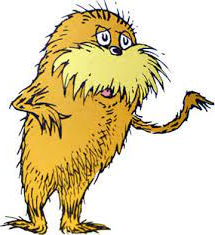

# LORAX

**LORAX** = LORAX Optimizes and Renders AI eXplanations**

Explore `N` options after evaluating `log(log(N))` examples.

Find two distant points. Score them _best, rest_.   Prune everything closest to _rest_. Recurse on the remaining.
